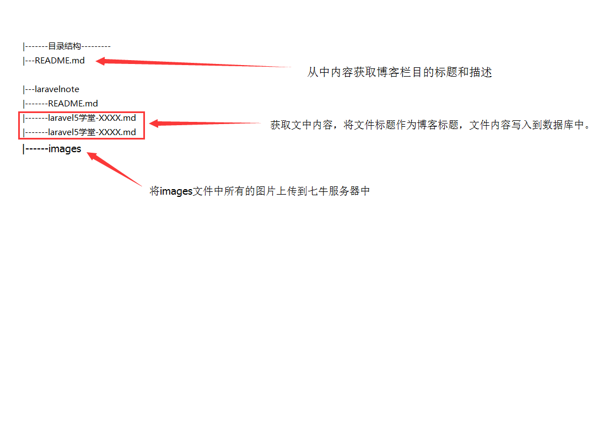
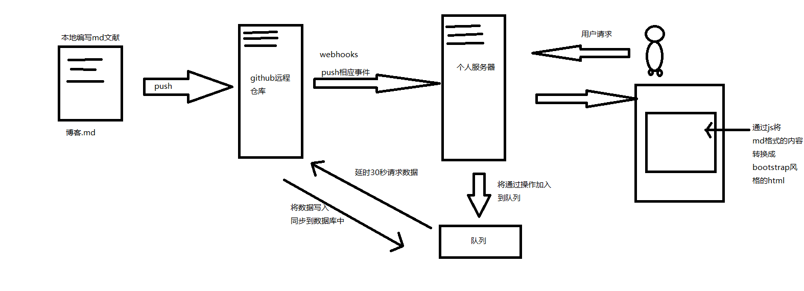
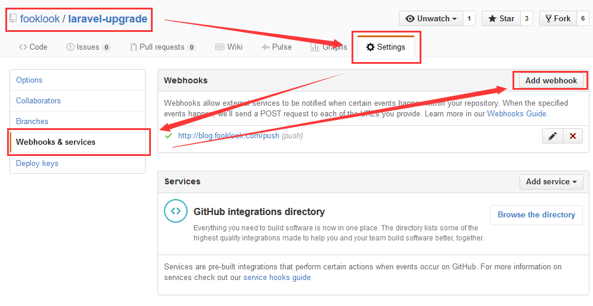
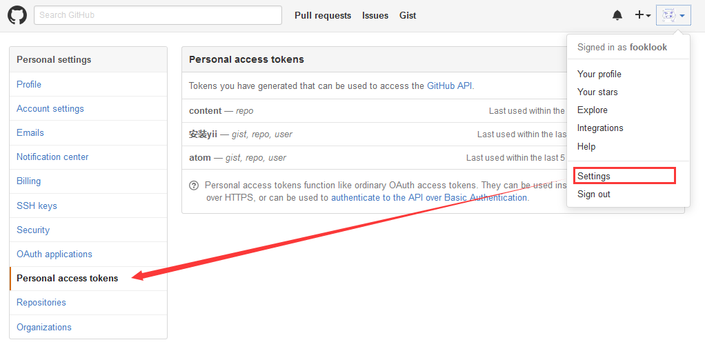
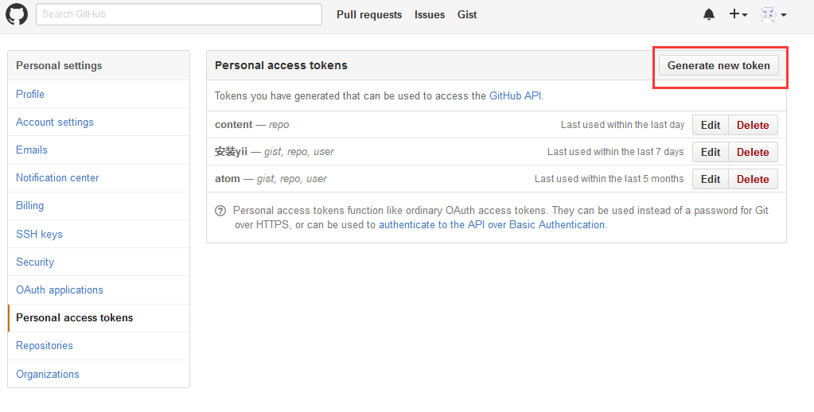

##个人庄园

集成个人博客、个人作品展示、个人兴趣爱好展示。

###项目同步原理

初始化批量导入原理



push响应同步原理



###项目安装

####clone项目源代码

clone程序源码

```shell
git clone git@github.com:fooklook/myhacienda.git
```

clone博客内容

```shell
git clone git@github.com:fooklook/laravel-upgrade.git
```
####创建webhooks服务



从中可以获取GITHUB_SECRET信息。

####创建GITHUB_TOKEN




从中获取GITHUB_TOKEN信息。

###获取七牛相关服务

到七牛官网注册一个账户，10G的免费空间，足够你储存博客图片。创建账号后，可以配置空间，从而获取相关配置信息。

####复制.env.example文件改为.env，并配置数据库、邮件代理发送配置和七牛配置。

```php
//配置说明
APP_ENV=local-----------------------------------|
APP_DEBUG=true                                  |
APP_KEY=SomeRandomString                        |
                                                |
DB_HOST=localhost                               |
DB_DATABASE=homestead                           |
DB_USERNAME=homestead                           基
DB_PASSWORD=secret                              本
                                                配
CACHE_DRIVER=file                               置
SESSION_DRIVER=file                             |
QUEUE_DRIVER=sync                               |
                                                |
//邮件服务器的相关配置                            |
MAIL_DRIVER=smtp                                |
MAIL_HOST=mailtrap.io                           |
MAIL_PORT=2525                                  |
MAIL_USERNAME=null                              |
MAIL_PASSWORD=null------------------------------|

MARKDOWN_URL=     <------------------|博客内容绝对路径

//注册七牛账号，使用免费云空间，相关账号配置。
QINIU_DOMAINS_DEFAULT=       -------------------|
QINIU_ASSESS_KEY=                               |
QINIU_SECRET_KEY=                           七牛账号配置
QINIU_BUCKET=                                   |
//七牛图片前缀                                    |
QINIU_PREFIX=                ------------------ |

//GITHUB相关配置
//在github中创建services中，填入的密钥。-----------------------|
GITHUB_SECRET=                                            |
//需要同步的项目名称                               github账户相关配置
GITHUB_REPOSITORY=                                        |
GITHUB_EMAIL=                                             |
GITHUB_USERNAME=                                          |
//在github网站中，个人设置，创建一个Personal access tokens    |
GITHUB_TOKEN=                      -----------------------|
```
####数据库初始化

```shell
//mysql创建数据库
CREATE DATABASE myhacienda DEFAULT CHARACTER SET utf8 COLLATE utf8_general_ci;
//生成表
php artisan migrate
//填充管理员数据
php artisan db:seed
//导入博客内容
php artisan lead:markdown
//根据文字提示依次数据管理员账号和密码
//在database/seeds/AdminUserSeeder.php文件中可以查看到。
//默认账户为：admin，默认密码为：123456
```

####添加后台同步队列

当你将博客内容推送到github远程创库时，github相关的API内容还未更新，所以会出现文章内容无法获取，或者内容为旧版本。

为了解决这个问题，使用了laravel框架的队列。

在服务器中开启后台队列接听，就可以延时30秒后同步github的push响应内容。

```shell
php artisan queue:listen &
```